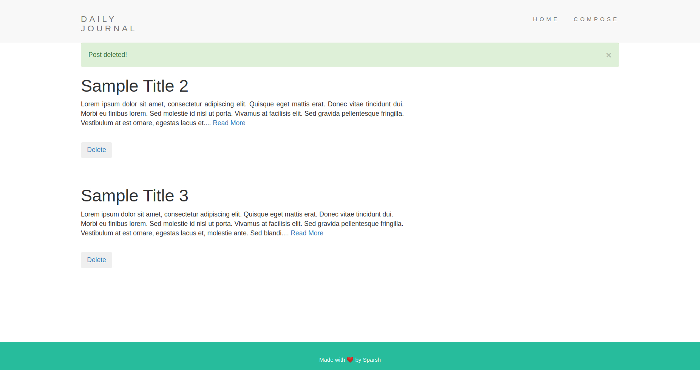
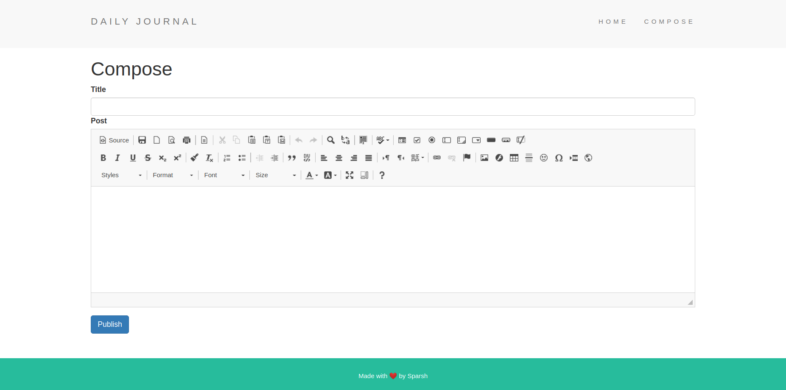

## A JOURNAL blogging web app built on PHP

A minimalistic website where anyone can compose a post and also view multiple posts present.
The site is backed by a mySQL database.
Following are the screenshots of the web app attached

 

## Usage
You should have PHP-myadmin installed.
 Import the blogdb.db file in the mysql server.
 Move the clonned repository in your **htdocs** folder.
